# Multi-Cycle Pipelined MIPS
<html>

<head>
<meta http-equiv=Content-Type content="text/html; charset=utf-8">
<meta name=Generator content="Microsoft Word 15 (filtered)">
</head>

<b>&nbsp;</b>

&nbsp;

<h2><a name="_Toc104314822">MIPS ISA</a></h2>

ISA(Instruction
Set Architecture)란 CPU가 소프트웨어로 어떻게 제어될지를 정의해 놓은 추상화 모델의 일종이다. ISA는 하드웨어와 소프트웨어 사이의 인터페이스 역할을 하며, 프로세서가 수행할 수 있는 기능과 처리 방법을 모두 명시한다. 본문에서는 MIPS-32 ISA중 정수 부분을 다룬다.

MIPS-32 ISA의 각 명령은 4바이트, 즉 32비트 크기의 이진수로 표현하고 하나의 명령어에 하나의 연산을 수행한다. MIPS 프로세서는 4바이트 크기의 General Purpose Register 32개를 갖고 있고, 각각 $0 ~ $31로 표현한다. 이 중 $0은 항상 0의 값을 가지며, $31은 프로그램 실행 도중 jal 등의 명령어 수행으로 다른 곳으로 점프했을 때 점프 명령어의 주소 + 4 혹은 + 8 을 저장하는 레지스터이다.

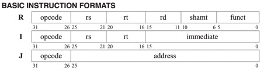

기본적인 명령어로는 R형식, I형식, J형식이 있다. opcode는 세 형식 모두 상위 6비트로 동일하다. R형식은 opcode가 0인 명령어로, 5비트 크기의 레지스터 번호 rs, rt, rd와 명령어가 sll,
srl일 경우 사용할 shamt, 명령어를 구분할 6비트 크기의 funct를 갖는다. R형식은 대부분의 경우 R[rs]와 R[rt]를 연산한 결과를 R[rd]에 저장하는 명령어이다.

I형식은 5비트 크기의 레지스터 번호 rs, rt와 16비트 크기의 immediate를 갖는다. I형식 명령어는 대부분의 경우 immediate를 opcode에 따라 부호확장이나 제로확장 한
후 R[rs]와의 연산을 거쳐 R[rt]에 저장하는 명령어이다.

J형식은 26비트 크기의 address를 갖는다. address는 왼쪽으로 2번 shift된 후 PC값의 상위 4비트를 address의 상위비트 앞에 연결함으로써 jump target주소로 계산된다.

필자가 작성한 프로그램에서 구현한 명령어는
다음과 같다.

-&nbsp;&nbsp;&nbsp;&nbsp;&nbsp;&nbsp;
R형식 : add, addu, and, jalr, jr, nor, or, slt, sltu, sll, srl, sub, subu

-&nbsp;&nbsp;&nbsp;&nbsp;&nbsp;&nbsp;
I형식 : addi, addiu, andi, beq, bne, lui, lw, ori, slti, sltiu, sw

-&nbsp;&nbsp;&nbsp;&nbsp;&nbsp;&nbsp;
J형식 : j, jal

<h2><a name="_Toc104314823">Multi-Cycle Pipelined MIPS processor</a></h2>

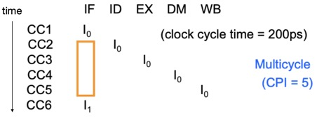<a href="#_edn1"
name="_ednref1" title="">[i]</a>(tistory, n.d.)

Multi-Cycle은 하나의 명령어를 여러 단계로 나눠서 각 단계를 한 클럭 사이클마다 처리하는 방법이다. 따라서 명령어 당 사이클 수(CPI)는 나눈 단계의 개수이다. 파이프라이닝은 여기서
파이프라인 레지스터를 도입한 방식이다.

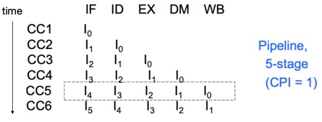<a
href="#_edn2" name="_ednref2" title="">[ii]</a>(tistory, n.d.)

각 단계 사이에 파이프라인 레지스터를
놓아서 클럭 신호가 상향 엣지일때 파이프라인에 저장된 데이터를 다음 단계로 fetch하고 하향 엣지일때 이전 단계에서 나온 값이 파이프라인에 저장된다. 5단계로 명령어 실행 과정을 나눴을 때 파이프라인을 통해 한 클럭 사이클당 최대 5개의 명령어를 실행 할 수 있으므로 명령어 처리율을 크게 향상시킬 수 있다.

&nbsp;

<h2><a name="_Toc104314824">Single-Cycle</a>과의 차이</h2>

명령어를 Single-Cycle보다 Clock
Cycle Time을 작게 정해서 Multi-Cycle로 수행하면 CPI는 증가하게 되지만 R형식 명령어나 j 명령어와 같이 실행되는 명령어가 필요한 단계만 거쳐가게 되므로 총 Clock
Cycle은 감소하게 된다. 따라서 전체적인 성능에 향상이 이루어진다. 여기에
파이프라인을 도입하면 모든 명령어가 모든 단계를 거쳐가게 되지만, 한번에 실행할 수 있는 명령어가 많아지고, 매 Clock Cycle 마다 하나의 명령어가 실행완료 되므로 파이프라인의 CPI는 이상적일 때 1이 된다.

하지만 앞에서 “이상적일 때” 라 말했듯이 파이프라이닝에 결점이 없는 것은 아니다. 파이프라인을 도입하게 되면 Single Cycle에는 존재하지 않던 Data dependency와
Control dependency가 생긴다. 이런 hazard가 발생하면 CPI가 1보다 높아지는 경우가 생길 수도 있고, 결과값이 달라질 수도 있다.

&nbsp;

<h2><a name="_Toc104314825">Data dependency</a></h2>

Data dependency의 종류는 다음 표와 같다.

<table class=MsoTableGrid border=1 cellspacing=0 cellpadding=0
 style='border-collapse:collapse;border:none'>
 <tr>
  <td width=200 valign=top style='width:150.25pt;border:solid windowtext 1.0pt;
  background:#B4C6E7;padding:0cm 5.4pt 0cm 5.4pt'>
  
구분

  </td>
  <td width=200 valign=top style='width:150.25pt;border:solid windowtext 1.0pt;
  border-left:none;background:#B4C6E7;padding:0cm 5.4pt 0cm 5.4pt'>
  
내용

  </td>
  <td width=200 valign=top style='width:150.3pt;border:solid windowtext 1.0pt;
  border-left:none;background:#B4C6E7;padding:0cm 5.4pt 0cm 5.4pt'>
  
예시

  </td>
 </tr>
 <tr>
  <td width=200 valign=top style='width:150.25pt;border:solid windowtext 1.0pt;
  border-top:none;padding:0cm 5.4pt 0cm 5.4pt'>
  
RAW (Read After Write)

  </td>
  <td width=200 valign=top style='width:150.25pt;border-top:none;border-left:
  none;border-bottom:solid windowtext 1.0pt;border-right:solid windowtext 1.0pt;
  padding:0cm 5.4pt 0cm 5.4pt'>
  
이전 명령이 저장한 연산 결과를 후속 명령이 읽으려고 할 때

  </td>
  <td width=200 valign=top style='width:150.3pt;border-top:none;border-left:
  none;border-bottom:solid windowtext 1.0pt;border-right:solid windowtext 1.0pt;
  padding:0cm 5.4pt 0cm 5.4pt'>
  
add <b>r1</b> &lt;- r2, r3

  
add r4 &lt;- <b>r1</b>, r5

  </td>
 </tr>
 <tr>
  <td width=200 valign=top style='width:150.25pt;border:solid windowtext 1.0pt;
  border-top:none;padding:0cm 5.4pt 0cm 5.4pt'>
  
WAR (Write After Read)

  </td>
  <td width=200 valign=top style='width:150.25pt;border-top:none;border-left:
  none;border-bottom:solid windowtext 1.0pt;border-right:solid windowtext 1.0pt;
  padding:0cm 5.4pt 0cm 5.4pt'>
  
이전 명령이 값을 읽기 전에 후속 명령이 값을 쓰는 경우

  </td>
  <td width=200 valign=top style='width:150.3pt;border-top:none;border-left:
  none;border-bottom:solid windowtext 1.0pt;border-right:solid windowtext 1.0pt;
  padding:0cm 5.4pt 0cm 5.4pt'>
  
add r1 &lt;- <b>r2</b>, r3

  
sub <b>r2</b> &lt;- r4, r1

  </td>
 </tr>
 <tr>
  <td width=200 valign=top style='width:150.25pt;border:solid windowtext 1.0pt;
  border-top:none;padding:0cm 5.4pt 0cm 5.4pt'>
  
WAW (Write After Write)

  </td>
  <td width=200 valign=top style='width:150.25pt;border-top:none;border-left:
  none;border-bottom:solid windowtext 1.0pt;border-right:solid windowtext 1.0pt;
  padding:0cm 5.4pt 0cm 5.4pt'>
  
이전 명령이 값을 쓰기 전에 후속 명령이 값을 쓰는 경우

  </td>
  <td width=200 valign=top style='width:150.3pt;border-top:none;border-left:
  none;border-bottom:solid windowtext 1.0pt;border-right:solid windowtext 1.0pt;
  padding:0cm 5.4pt 0cm 5.4pt'>
  
add <b>r1</b> &lt;- r2, r3

  
sub r2 &lt;- r4, r1

  
or <b>r1</b> &lt;- r6, r3

  </td>
 </tr>
</table>

WAW, WAR의 경우 단일 파이프라인에서는 발생하지 않기 때문에 우리가 고려해야 할 것은 RAW뿐이다. RAW는 같은 레지스터에 쓰고 읽는 명령어들
사이 거리가 3 이하일 때 발생한다. RAW hazard를 해결하기 위하여 필자가 작성한 프로그램에서 구현한 방법은 Forwarding과 Stalling이다.

<h2><a name="_Toc104314826">Control dependency</a></h2>

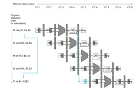

<a href="#_edn3"
name="_ednref3" title="">[iii]</a>(David A. Patterson, John
L. Hennessy, n.d.)

위 그림처럼 Fetch(IF) 단계에서 명령어가 fetch된 후 Decode(ID) 단계에서 어떤 명령어인지
식별하는데, 이 때 식별된 명령어가 conditional jump(beq, bne)인 경우 branch target address는 Execution(EX)
단계에서 계산되어 Memory access(MEM) 단계에 분기 여부가 결정나게 된다. 이를 위해선
분기 명령어가 MEM단계까지 가는 동안인 3cycle동안 NOP가 수행되어야 한다. 그러나 이는 성능에 있어서
큰 손실을 야기한다. 필자가 작성한 프로그램에선 이러한 손실을 1cycle로 줄이기 위해 ID단계에서 두 레지스터 값을 comparator로
비교함과 동시에 branch target address를 계산하도록
구현하였다. 단, branch
연산을 ID단계에서 완료되도록
하면 Data dependency가 추가적으로 일어나게 된다. 이에 대한 Forwarding 및 Stalling은 Implementation-전방전달 유닛에서 설명한다.

&nbsp;

<h2><a name="_Toc104314827">분기 예측</a></h2>

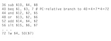

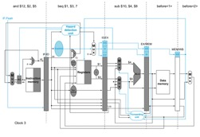

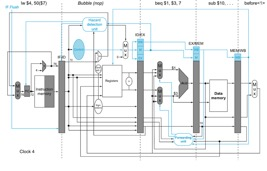

<a href="#_edn4"
name="_ednref4" title="">[iv]</a>(David A. Patterson, John
L. Hennessy, n.d.)

분기 연산을 ID로 옮김으로써 3cycle이던 NOP를 1cycle로 줄였지만, 여전히 성능손실은 남아있다. 이를 최대한 없애기
위해선 분기 예측이 필요하다. IF단계에서 Instruction memory로 PC값을 보낸 직후 분기 예측기를 통해 PC + 4와
branch target address 중 다음 PC값을 정하고, 다음 Clock Cycle에서 예측이 맞으면 NOP가 하나 줄어들어 이득을 볼 수 있고,
만약 틀리면 그 때 IF/ID 파이프라인의 명령어를 0으로 변경하여 NOP를 추가하면 된다. 위 사진과 같이 Clock 3에서 not taken이라 예측을 하고 0x44
주소의 명령어를 fetch하였지만, Clock 4에서 Decode 후 beq가 taken이라는 것을 알게 되었으므로 Control unit에서 IF.Flush신호를 인가하여 IF/ID 파이프라인의 명령어 부분을
0으로 만들어 NOP를 추가하는 것이다.

<b> 
</b>

<b>&nbsp;</b>

<h1><a name="_Toc104314828"><b>Implementation</b></a></h1>

&nbsp;

<h2><a name="_Toc104314829">제어 신호</a></h2>

<table class=MsoTableGrid border=1 cellspacing=0 cellpadding=0 width=643
 style='width:482.0pt;margin-left:-14.45pt;border-collapse:collapse;border:
 none'>
 <tr>
  <td width=66 valign=top style='width:49.65pt;border:solid windowtext 1.0pt;
  background:#B4C6E7;padding:0cm 5.4pt 0cm 5.4pt'>
  
<b>신호 이름</b>

  </td>
  <td width=293 valign=top style='width:219.7pt;border:solid windowtext 1.0pt;
  border-left:none;background:#B4C6E7;padding:0cm 5.4pt 0cm 5.4pt'>
  
<b>인가되지
  않은 경우 </b><b>(0)</b>

  </td>
  <td width=284 valign=top style='width:212.65pt;border:solid windowtext 1.0pt;
  border-left:none;background:#B4C6E7;padding:0cm 5.4pt 0cm 5.4pt'>
  
<b>인가된 경우
  </b><b>(1)</b>

  </td>
 </tr>
 <tr>
  <td width=66 valign=top style='width:49.65pt;border:solid windowtext 1.0pt;
  border-top:none;padding:0cm 5.4pt 0cm 5.4pt'>
  
ALUSrc

  </td>
  <td width=293 valign=top style='width:219.7pt;border-top:none;border-left:
  none;border-bottom:solid windowtext 1.0pt;border-right:solid windowtext 1.0pt;
  padding:0cm 5.4pt 0cm 5.4pt'>
  
ALU의 두번째 피연산자로 R[rt]가 들어옴

  </td>
  <td width=284 valign=top style='width:212.65pt;border-top:none;border-left:
  none;border-bottom:solid windowtext 1.0pt;border-right:solid windowtext 1.0pt;
  padding:0cm 5.4pt 0cm 5.4pt'>
  
ALU의 두번째 피연산자로 부호 혹은 제로확장된

  
immediate가 들어옴

  </td>
 </tr>
 <tr>
  <td width=66 valign=top style='width:49.65pt;border:solid windowtext 1.0pt;
  border-top:none;padding:0cm 5.4pt 0cm 5.4pt'>
  
RegWrite

  </td>
  <td width=293 valign=top style='width:219.7pt;border-top:none;border-left:
  none;border-bottom:solid windowtext 1.0pt;border-right:solid windowtext 1.0pt;
  padding:0cm 5.4pt 0cm 5.4pt'>
  
아무 일도 생기지 않음

  </td>
  <td width=284 valign=top style='width:212.65pt;border-top:none;border-left:
  none;border-bottom:solid windowtext 1.0pt;border-right:solid windowtext 1.0pt;
  padding:0cm 5.4pt 0cm 5.4pt'>
  
레지스터에 쓰기 활성화

  </td>
 </tr>
 <tr>
  <td width=66 valign=top style='width:49.65pt;border:solid windowtext 1.0pt;
  border-top:none;padding:0cm 5.4pt 0cm 5.4pt'>
  
MemRead

  </td>
  <td width=293 valign=top style='width:219.7pt;border-top:none;border-left:
  none;border-bottom:solid windowtext 1.0pt;border-right:solid windowtext 1.0pt;
  padding:0cm 5.4pt 0cm 5.4pt'>
  
아무 일도 생기지 않음

  </td>
  <td width=284 valign=top style='width:212.65pt;border-top:none;border-left:
  none;border-bottom:solid windowtext 1.0pt;border-right:solid windowtext 1.0pt;
  padding:0cm 5.4pt 0cm 5.4pt'>
  
Data memory에 읽기 활성화

  </td>
 </tr>
 <tr>
  <td width=66 valign=top style='width:49.65pt;border:solid windowtext 1.0pt;
  border-top:none;padding:0cm 5.4pt 0cm 5.4pt'>
  
MemWrite

  </td>
  <td width=293 valign=top style='width:219.7pt;border-top:none;border-left:
  none;border-bottom:solid windowtext 1.0pt;border-right:solid windowtext 1.0pt;
  padding:0cm 5.4pt 0cm 5.4pt'>
  
아무 일도 생기지 않음

  </td>
  <td width=284 valign=top style='width:212.65pt;border-top:none;border-left:
  none;border-bottom:solid windowtext 1.0pt;border-right:solid windowtext 1.0pt;
  padding:0cm 5.4pt 0cm 5.4pt'>
  
Data memory에 쓰기 활성화

  </td>
 </tr>
 <tr>
  <td width=66 valign=top style='width:49.65pt;border:solid windowtext 1.0pt;
  border-top:none;padding:0cm 5.4pt 0cm 5.4pt'>
  
SignZero

  </td>
  <td width=293 valign=top style='width:219.7pt;border-top:none;border-left:
  none;border-bottom:solid windowtext 1.0pt;border-right:solid windowtext 1.0pt;
  padding:0cm 5.4pt 0cm 5.4pt'>
  
ALUSrc MUX로 부호확장된 immediate가 들어옴

  </td>
  <td width=284 valign=top style='width:212.65pt;border-top:none;border-left:
  none;border-bottom:solid windowtext 1.0pt;border-right:solid windowtext 1.0pt;
  padding:0cm 5.4pt 0cm 5.4pt'>
  
ALUSrc MUX로 제로확장된 immediate가 들어옴

  </td>
 </tr>
 <tr>
  <td width=66 valign=top style='width:49.65pt;border:solid windowtext 1.0pt;
  border-top:none;padding:0cm 5.4pt 0cm 5.4pt'>
  
Shift

  </td>
  <td width=293 valign=top style='width:219.7pt;border-top:none;border-left:
  none;border-bottom:solid windowtext 1.0pt;border-right:solid windowtext 1.0pt;
  padding:0cm 5.4pt 0cm 5.4pt'>
  
ALU 첫번째 입력으로 R[rs]가 들어옴

  </td>
  <td width=284 valign=top style='width:212.65pt;border-top:none;border-left:
  none;border-bottom:solid windowtext 1.0pt;border-right:solid windowtext 1.0pt;
  padding:0cm 5.4pt 0cm 5.4pt'>
  
ALU 첫번째 입력으로 shamt가 들어옴

  </td>
 </tr>
 <tr>
  <td width=66 valign=top style='width:49.65pt;border:solid windowtext 1.0pt;
  border-top:none;padding:0cm 5.4pt 0cm 5.4pt'>
  
IFFlush

  </td>
  <td width=293 valign=top style='width:219.7pt;border-top:none;border-left:
  none;border-bottom:solid windowtext 1.0pt;border-right:solid windowtext 1.0pt;
  padding:0cm 5.4pt 0cm 5.4pt'>
  
아무 일도 생기지 않음

  </td>
  <td width=284 valign=top style='width:212.65pt;border-top:none;border-left:
  none;border-bottom:solid windowtext 1.0pt;border-right:solid windowtext 1.0pt;
  padding:0cm 5.4pt 0cm 5.4pt'>
  
IF/ID 파이프라인의 명령어를 0x00000000 으로 변경

  </td>
 </tr>
</table>

&nbsp;

<table class=MsoTableGrid border=1 cellspacing=0 cellpadding=0 width=643
 style='width:482.0pt;margin-left:-14.45pt;border-collapse:collapse;border:
 none'>
 <tr>
  <td width=66 valign=top style='width:49.65pt;border:solid windowtext 1.0pt;
  background:#B4C6E7;padding:0cm 5.4pt 0cm 5.4pt'>
  
<b>신호 이름</b>

  </td>
  <td width=161 valign=top style='width:120.5pt;border:solid windowtext 1.0pt;
  border-left:none;background:#B4C6E7;padding:0cm 5.4pt 0cm 5.4pt'>
  
<b>0</b>

  </td>
  <td width=142 valign=top style='width:106.3pt;border:solid windowtext 1.0pt;
  border-left:none;background:#B4C6E7;padding:0cm 5.4pt 0cm 5.4pt'>
  
<b>1</b>

  </td>
  <td width=133 valign=top style='width:100.1pt;border:solid windowtext 1.0pt;
  border-left:none;background:#B4C6E7;padding:0cm 5.4pt 0cm 5.4pt'>
  
<b>2</b>

  </td>
  <td width=141 valign=top style='width:105.45pt;border:solid windowtext 1.0pt;
  border-left:none;background:#B4C6E7;padding:0cm 5.4pt 0cm 5.4pt'>
  
<b>3</b>

  </td>
 </tr>
 <tr>
  <td width=66 valign=top style='width:49.65pt;border:solid windowtext 1.0pt;
  border-top:none;padding:0cm 5.4pt 0cm 5.4pt'>
  
RegDst

  </td>
  <td width=161 valign=top style='width:120.5pt;border-top:none;border-left:
  none;border-bottom:solid windowtext 1.0pt;border-right:solid windowtext 1.0pt;
  padding:0cm 5.4pt 0cm 5.4pt'>
  
ID/EX 파이프라인의 rt가

  
레지스터의
  Write register

  
번호 입력이 됨

  </td>
  <td width=142 valign=top style='width:106.3pt;border-top:none;border-left:
  none;border-bottom:solid windowtext 1.0pt;border-right:solid windowtext 1.0pt;
  padding:0cm 5.4pt 0cm 5.4pt'>
  
ID/EX 파이프라인의 rd가 레지스터의 Write register

  
번호 입력이 됨

  </td>
  <td width=133 valign=top style='width:100.1pt;border-top:none;border-left:
  none;border-bottom:solid windowtext 1.0pt;border-right:solid windowtext 1.0pt;
  padding:0cm 5.4pt 0cm 5.4pt'>
  
31이 레지스터의

  
Write register 번호 입력이 됨

  </td>
  <td width=141 valign=top style='width:105.45pt;border-top:none;border-left:
  none;border-bottom:solid windowtext 1.0pt;border-right:solid windowtext 1.0pt;
  padding:0cm 5.4pt 0cm 5.4pt'>
  
없음

  </td>
 </tr>
 <tr>
  <td width=66 valign=top style='width:49.65pt;border:solid windowtext 1.0pt;
  border-top:none;padding:0cm 5.4pt 0cm 5.4pt'>
  
MemtoReg

  </td>
  <td width=161 valign=top style='width:120.5pt;border-top:none;border-left:
  none;border-bottom:solid windowtext 1.0pt;border-right:solid windowtext 1.0pt;
  padding:0cm 5.4pt 0cm 5.4pt'>
  
EX/MEM 파이프라인의

  
ALU result가 Write
  data

  
입력이 됨

  </td>
  <td width=142 valign=top style='width:106.3pt;border-top:none;border-left:
  none;border-bottom:solid windowtext 1.0pt;border-right:solid windowtext 1.0pt;
  padding:0cm 5.4pt 0cm 5.4pt'>
  
데이터 메모리의

  
Read data가 레지스터의 Write data 입력이 됨

  </td>
  <td width=133 valign=top style='width:100.1pt;border-top:none;border-left:
  none;border-bottom:solid windowtext 1.0pt;border-right:solid windowtext 1.0pt;
  padding:0cm 5.4pt 0cm 5.4pt'>
  
MEM/WB 파이프라인의 PC
  + 8이 레지스터의 Write data 입력이 됨

  </td>
  <td width=141 valign=top style='width:105.45pt;border-top:none;border-left:
  none;border-bottom:solid windowtext 1.0pt;border-right:solid windowtext 1.0pt;
  padding:0cm 5.4pt 0cm 5.4pt'>
  
MEM/WB 파이프라인의 upperimm이 레지스터의 Write data 입력이 됨

  </td>
 </tr>
 <tr>
  <td width=66 valign=top style='width:49.65pt;border:solid windowtext 1.0pt;
  border-top:none;padding:0cm 5.4pt 0cm 5.4pt'>
  
Jump

  </td>
  <td width=161 valign=top style='width:120.5pt;border-top:none;border-left:
  none;border-bottom:solid windowtext 1.0pt;border-right:solid windowtext 1.0pt;
  padding:0cm 5.4pt 0cm 5.4pt'>
  
Predict MUX로 IDBr
  MUX의 출력이 들어옴

  </td>
  <td width=142 valign=top style='width:106.3pt;border-top:none;border-left:
  none;border-bottom:solid windowtext 1.0pt;border-right:solid windowtext 1.0pt;
  padding:0cm 5.4pt 0cm 5.4pt'>
  
Predict MUX로 JumpAddr가 들어옴

  </td>
  <td width=133 valign=top style='width:100.1pt;border-top:none;border-left:
  none;border-bottom:solid windowtext 1.0pt;border-right:solid windowtext 1.0pt;
  padding:0cm 5.4pt 0cm 5.4pt'>
  
Predict MUX로

  
IDForwardA MUX의

  
출력이 들어옴

  </td>
  <td width=141 valign=top style='width:105.45pt;border-top:none;border-left:
  none;border-bottom:solid windowtext 1.0pt;border-right:solid windowtext 1.0pt;
  padding:0cm 5.4pt 0cm 5.4pt'>
  
없음

  </td>
 </tr>
</table>

&nbsp;

추가적으로 표에 명시되지 않은 제어신호로는
BEQ, BNE, Branch, Equal, PCBranch, ALUOp가 있다. BEQ와 BNE의 경우 명령어가 각각 beq,
bne이면 인가되고, Branch는 이 둘을 OR연산한 신호이다. 식으로 표현하면 Branch = BEQ
| BNE와 같다. Equal은 ID단계의 comparator에서 IDForwardA
MUX와 IDForwardB MUX의 출력 값이 같은 지 비교해서 같으면 인가되고 같지 않으면 인가되지 않는다.
PCBranch는 BNE와
NOT게이트를 통과한 Equal을 AND연산한 값과 BEQ와 Equal을 AND연산한 값 둘을 OR연산한 신호이다. 이 또한 식으로 표현하면 PCBranch
= (BNE &amp; !Equal) | (BEQ &amp; Equal) 과 같다. 다시 말하면, Branch 신호는 명령어가 beq나 bne이면 인가되고, PCBranch 신호는 분기 명령어가 taken되면 인가되는 신호라고
볼 수 있다. ALUOp의 경우 명령어가 R형식이면 funct에 따라, 이외 형식인 경우 opcode에 따라서 ALU에 어떤 연산을 할지 설정하는 신호이다.

<h2><a name="_Toc104314830">파이프라인</a></h2>

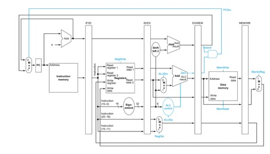<a
href="#_edn5" name="_ednref5" title="">[v]</a>(David A. Patterson, John
L. Hennessy, n.d.)

파이프라인은 각 단계 사이에 latch를 말하는데, 클럭 신호가 상향 엣지일 때 latch에 저장된
데이터들을 다음 단계로 출력하고, 하향 엣지일 때 이전 단계에서
출력된 데이터들을 저장한다. 위 사진에서 IF/ID, ID/EX, EX/MEM, MEM/WB가 파이프라인 latch들이다. 이러한 파이프라인을 구현하기 위해서 필자가 작성한 프로그램에서는 구조체 배열을 사용하였다.

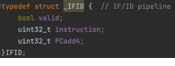

위와 같이 구조체를 각 파이프라인마다 생성하고 파이프라인에 저장되는 데이터들을 구조체
멤버로 선언한다.

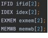

이처럼 구조체를 배열로 선언하고 한 Clock
Cycle이 끝날 때마다 아래 사진의 ifid[1] = ifid[0]과 같이 [0]에 있는 데이터들을 [1]로 넘겨준다면 매 Clock
Cycle마다 다음 단계로 데이터를 넘겨주는 파이프라인을 구현할 수 있다.

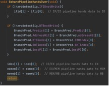

&nbsp;

<h2><a name="_Toc104314831">전방전달 유닛</a></h2>

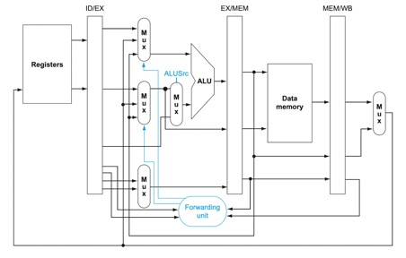<a
href="#_edn6" name="_ednref6" title="">[vi]</a>(David A. Patterson, John
L. Hennessy, n.d.)

Data dependency를 극복하기 위해 후속 파이프라인의 데이터를 ALU의 입력으로 전달해주는 유닛이다. EX단계에서 ALU에 입력되는 레지스터가 EX/MEM 파이프라인의 Write register와 동일하거나 MEM/WB 파이프라인의 Write
register와 동일한 경우 전방전달 유닛에서 이를 감지하고 MUX를 통해 해당 단계에서의 입력 값을 ALU로 전달하게 된다.

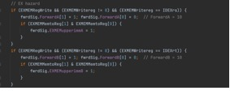

EX단계와 MEM단계 사이의 Data
dependency를 탐지하기 위한 조건문은 위와 같다. 필자가 작성한 프로그램에서 구현한 파이프라인은 lui 명령어를 지원하므로 MEM단계의 upperimm을 가져오기 위해 EX/MEM
파이프라인의 MemtoReg 신호가 11(2)인 경우 전방전달 유닛에서 EXMEMupperimm 신호를 인가하는 기능을 추가하였다. EX단계와 WB단계 사이의 Data dependency를 탐지하기
위한 코드는 아래와 같다.

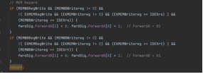

전방전달 유닛이 후속 단계의 값을 ALU로 전달하기 위해서는 앞에서 말했듯이 MUX에 신호를
인가해야 한다. 이 중 ALU의 첫번째 입력에 관여하는 신호는 ForwardA와 EXMEMupperimmA, 두번째 입력에 관여하는
신호는 ForwardB와 EXMEMupperimmB이다. 이 신호들이 의미하는 바는 다음 표와 같다.

<table class=MsoTableGrid border=1 cellspacing=0 cellpadding=0 width=643
 style='width:482.0pt;margin-left:-14.45pt;border-collapse:collapse;border:
 none'>
 <tr>
  <td width=132 valign=top style='width:99.25pt;border:solid windowtext 1.0pt;
  background:#B4C6E7;padding:0cm 5.4pt 0cm 5.4pt'>
  
전방전달 신호

  </td>
  <td width=123 valign=top style='width:92.15pt;border:solid windowtext 1.0pt;
  border-left:none;background:#B4C6E7;padding:0cm 5.4pt 0cm 5.4pt'>
  
소스

  </td>
  <td width=387 valign=top style='width:290.6pt;border:solid windowtext 1.0pt;
  border-left:none;background:#B4C6E7;padding:0cm 5.4pt 0cm 5.4pt'>
  
설명

  </td>
 </tr>
 <tr>
  <td width=132 valign=top style='width:99.25pt;border:solid windowtext 1.0pt;
  border-top:none;padding:0cm 5.4pt 0cm 5.4pt'>
  
ForwardA = 00

  </td>
  <td width=123 valign=top style='width:92.15pt;border-top:none;border-left:
  none;border-bottom:solid windowtext 1.0pt;border-right:solid windowtext 1.0pt;
  padding:0cm 5.4pt 0cm 5.4pt'>
  
ID/EX 파이프라인

  </td>
  <td width=387 valign=top style='width:290.6pt;border-top:none;border-left:
  none;border-bottom:solid windowtext 1.0pt;border-right:solid windowtext 1.0pt;
  padding:0cm 5.4pt 0cm 5.4pt'>
  
ALU 첫번째 입력으로 레지스터에서 읽은 값이 들어옴

  </td>
 </tr>
 <tr>
  <td width=132 valign=top style='width:99.25pt;border:solid windowtext 1.0pt;
  border-top:none;padding:0cm 5.4pt 0cm 5.4pt'>
  
ForwardA = 10

  </td>
  <td width=123 valign=top style='width:92.15pt;border-top:none;border-left:
  none;border-bottom:solid windowtext 1.0pt;border-right:solid windowtext 1.0pt;
  padding:0cm 5.4pt 0cm 5.4pt'>
  
EX/MEM 파이프라인

  </td>
  <td width=387 valign=top style='width:290.6pt;border-top:none;border-left:
  none;border-bottom:solid windowtext 1.0pt;border-right:solid windowtext 1.0pt;
  padding:0cm 5.4pt 0cm 5.4pt'>
  
ALU 첫번째 입력으로 EX/MEM 파이프라인의
  ALU result 혹은

  
upperimm이 들어옴

  </td>
 </tr>
 <tr>
  <td width=132 valign=top style='width:99.25pt;border:solid windowtext 1.0pt;
  border-top:none;padding:0cm 5.4pt 0cm 5.4pt'>
  
ForwardA = 01

  </td>
  <td width=123 valign=top style='width:92.15pt;border-top:none;border-left:
  none;border-bottom:solid windowtext 1.0pt;border-right:solid windowtext 1.0pt;
  padding:0cm 5.4pt 0cm 5.4pt'>
  
WB단계

  </td>
  <td width=387 valign=top style='width:290.6pt;border-top:none;border-left:
  none;border-bottom:solid windowtext 1.0pt;border-right:solid windowtext 1.0pt;
  padding:0cm 5.4pt 0cm 5.4pt'>
  
ALU 첫번째 입력으로 WB단계의 MemtoReg MUX의 출력값이 들어옴

  </td>
 </tr>
 <tr>
  <td width=132 valign=top style='width:99.25pt;border:solid windowtext 1.0pt;
  border-top:none;padding:0cm 5.4pt 0cm 5.4pt'>
  
ForwardB = 00

  </td>
  <td width=123 valign=top style='width:92.15pt;border-top:none;border-left:
  none;border-bottom:solid windowtext 1.0pt;border-right:solid windowtext 1.0pt;
  padding:0cm 5.4pt 0cm 5.4pt'>
  
ID/EX 파이프라인

  </td>
  <td width=387 valign=top style='width:290.6pt;border-top:none;border-left:
  none;border-bottom:solid windowtext 1.0pt;border-right:solid windowtext 1.0pt;
  padding:0cm 5.4pt 0cm 5.4pt'>
  
ALU 두번째 입력으로 레지스터에서 읽은 값이 들어옴

  </td>
 </tr>
 <tr>
  <td width=132 valign=top style='width:99.25pt;border:solid windowtext 1.0pt;
  border-top:none;padding:0cm 5.4pt 0cm 5.4pt'>
  
ForwardB = 10

  </td>
  <td width=123 valign=top style='width:92.15pt;border-top:none;border-left:
  none;border-bottom:solid windowtext 1.0pt;border-right:solid windowtext 1.0pt;
  padding:0cm 5.4pt 0cm 5.4pt'>
  
EX/MEM 파이프라인

  </td>
  <td width=387 valign=top style='width:290.6pt;border-top:none;border-left:
  none;border-bottom:solid windowtext 1.0pt;border-right:solid windowtext 1.0pt;
  padding:0cm 5.4pt 0cm 5.4pt'>
  
ALU 두번째 입력으로 EX/MEM 파이프라인의
  ALU result 혹은

  
upperimm이 들어옴

  </td>
 </tr>
 <tr>
  <td width=132 valign=top style='width:99.25pt;border:solid windowtext 1.0pt;
  border-top:none;padding:0cm 5.4pt 0cm 5.4pt'>
  
ForwardB = 01

  </td>
  <td width=123 valign=top style='width:92.15pt;border-top:none;border-left:
  none;border-bottom:solid windowtext 1.0pt;border-right:solid windowtext 1.0pt;
  padding:0cm 5.4pt 0cm 5.4pt'>
  
WB단계

  </td>
  <td width=387 valign=top style='width:290.6pt;border-top:none;border-left:
  none;border-bottom:solid windowtext 1.0pt;border-right:solid windowtext 1.0pt;
  padding:0cm 5.4pt 0cm 5.4pt'>
  
ALU 두번째 입력으로 WB단계의 MemtoReg MUX의 출력값이 들어옴

  </td>
 </tr>
 <tr>
  <td width=132 valign=top style='width:99.25pt;border:solid windowtext 1.0pt;
  border-top:none;padding:0cm 5.4pt 0cm 5.4pt'>
  
EXMEMupperimmA =
  0

  </td>
  <td width=123 valign=top style='width:92.15pt;border-top:none;border-left:
  none;border-bottom:solid windowtext 1.0pt;border-right:solid windowtext 1.0pt;
  padding:0cm 5.4pt 0cm 5.4pt'>
  
EX/MEM 파이프라인

  </td>
  <td width=387 valign=top style='width:290.6pt;border-top:none;border-left:
  none;border-bottom:solid windowtext 1.0pt;border-right:solid windowtext 1.0pt;
  padding:0cm 5.4pt 0cm 5.4pt'>
  
ForwardA MUX로 직전 명령어의 ALU result가
  들어옴

  </td>
 </tr>
 <tr>
  <td width=132 valign=top style='width:99.25pt;border:solid windowtext 1.0pt;
  border-top:none;padding:0cm 5.4pt 0cm 5.4pt'>
  
EXMEMupperimmA =
  1

  </td>
  <td width=123 valign=top style='width:92.15pt;border-top:none;border-left:
  none;border-bottom:solid windowtext 1.0pt;border-right:solid windowtext 1.0pt;
  padding:0cm 5.4pt 0cm 5.4pt'>
  
EX/MEM 파이프라인

  </td>
  <td width=387 valign=top style='width:290.6pt;border-top:none;border-left:
  none;border-bottom:solid windowtext 1.0pt;border-right:solid windowtext 1.0pt;
  padding:0cm 5.4pt 0cm 5.4pt'>
  
ForwardA MUX로 직전 명령어의 upperimm이
  들어옴

  </td>
 </tr>
 <tr>
  <td width=132 valign=top style='width:99.25pt;border:solid windowtext 1.0pt;
  border-top:none;padding:0cm 5.4pt 0cm 5.4pt'>
  
EXMEMupperimmB =
  0

  </td>
  <td width=123 valign=top style='width:92.15pt;border-top:none;border-left:
  none;border-bottom:solid windowtext 1.0pt;border-right:solid windowtext 1.0pt;
  padding:0cm 5.4pt 0cm 5.4pt'>
  
EX/MEM 파이프라인

  </td>
  <td width=387 valign=top style='width:290.6pt;border-top:none;border-left:
  none;border-bottom:solid windowtext 1.0pt;border-right:solid windowtext 1.0pt;
  padding:0cm 5.4pt 0cm 5.4pt'>
  
ForwardB MUX로 직전 명령어의 ALU result가
  들어옴

  </td>
 </tr>
 <tr>
  <td width=132 valign=top style='width:99.25pt;border:solid windowtext 1.0pt;
  border-top:none;padding:0cm 5.4pt 0cm 5.4pt'>
  
EXMEMupperimmB =
  1

  </td>
  <td width=123 valign=top style='width:92.15pt;border-top:none;border-left:
  none;border-bottom:solid windowtext 1.0pt;border-right:solid windowtext 1.0pt;
  padding:0cm 5.4pt 0cm 5.4pt'>
  
EX/MEM 파이프라인

  </td>
  <td width=387 valign=top style='width:290.6pt;border-top:none;border-left:
  none;border-bottom:solid windowtext 1.0pt;border-right:solid windowtext 1.0pt;
  padding:0cm 5.4pt 0cm 5.4pt'>
  
ForwardB MUX로 직전 명령어의 upperimm이
  들어옴

  </td>
 </tr>
</table>

&nbsp;

이로써 EX단계에서 발생하는 Data
dependency는 해결되었다. 하지만 필자가 작성한 프로그램에선 분기 연산을 EX단계가 아닌 ID단계에서 수행하도록 데이터패스를
수정하였다. 이때,
ID단계에 bne $1, $0, (target) 명령어가 수행 중이고 EX단계에 add $1 &lt;- $2, $3가 수행 중이라 가정해보자. EX단계의 명령어가 WB단계까지 진행되어 1번 레지스터에 값이 작성되도록
2cycle동안 NOP를 추가하거나, 1cycle만 NOP를 추가하고 명령어가 MEM단계로 진행되었을 때 전방전달을 하는 방법이 있다. 필자는 후자를 통해 새롭게 발생한 dependency를 해결하였다. 아래 사진과 같은 전방전달 유닛을
ID단계에 추가한다면 1cycle의 NOP만으로 이 문제를 해결할 수 있다. 단, beq나 bne 직전 명령어가 lw라면 MEM단계가 모두 진행되어야 값을 알 수 있기 때문에 2cycle의 NOP가 필요하다.

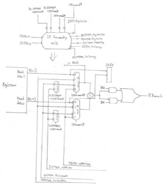

ID 전방전달 유닛은 EX단계에서의 것과 크게 다르지
않다. 다만,
ID/EX 파이프라인에서 전방전달 해야 할 데이터는 upperimm밖에 없다는 것이 특징이다. ALU 명령어가 직전으로
들어온다면 반드시 NOP를 거쳐야 하기 때문이다.

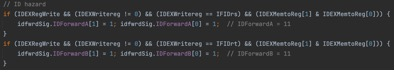

&nbsp;

&nbsp;

&nbsp;

&nbsp;

&nbsp;

ID 전방전달 유닛에서 인가하는 신호들이
의미하는 바는 다음 표와 같다.

<table class=MsoTableGrid border=1 cellspacing=0 cellpadding=0 width=643
 style='width:482.0pt;margin-left:-14.45pt;border-collapse:collapse;border:
 none'>
 <tr>
  <td width=151 valign=top style='width:113.45pt;border:solid windowtext 1.0pt;
  background:#B4C6E7;padding:0cm 5.4pt 0cm 5.4pt'>
  
전방전달 신호

  </td>
  <td width=123 valign=top style='width:92.15pt;border:solid windowtext 1.0pt;
  border-left:none;background:#B4C6E7;padding:0cm 5.4pt 0cm 5.4pt'>
  
소스

  </td>
  <td width=369 valign=top style='width:276.4pt;border:solid windowtext 1.0pt;
  border-left:none;background:#B4C6E7;padding:0cm 5.4pt 0cm 5.4pt'>
  
설명

  </td>
 </tr>
 <tr>
  <td width=151 valign=top style='width:113.45pt;border:solid windowtext 1.0pt;
  border-top:none;padding:0cm 5.4pt 0cm 5.4pt'>
  
IDForwardA = 00

  </td>
  <td width=123 valign=top style='width:92.15pt;border-top:none;border-left:
  none;border-bottom:solid windowtext 1.0pt;border-right:solid windowtext 1.0pt;
  padding:0cm 5.4pt 0cm 5.4pt'>
  
레지스터

  </td>
  <td width=369 valign=top style='width:276.4pt;border-top:none;border-left:
  none;border-bottom:solid windowtext 1.0pt;border-right:solid windowtext 1.0pt;
  padding:0cm 5.4pt 0cm 5.4pt'>
  
Comparator의 첫번째 입력으로 레지스터에서 읽은 값이 들어옴

  </td>
 </tr>
 <tr>
  <td width=151 valign=top style='width:113.45pt;border:solid windowtext 1.0pt;
  border-top:none;padding:0cm 5.4pt 0cm 5.4pt'>
  
IDForwardA = 10

  </td>
  <td width=123 valign=top style='width:92.15pt;border-top:none;border-left:
  none;border-bottom:solid windowtext 1.0pt;border-right:solid windowtext 1.0pt;
  padding:0cm 5.4pt 0cm 5.4pt'>
  
EX/MEM 파이프라인

  </td>
  <td width=369 valign=top style='width:276.4pt;border-top:none;border-left:
  none;border-bottom:solid windowtext 1.0pt;border-right:solid windowtext 1.0pt;
  padding:0cm 5.4pt 0cm 5.4pt'>
  
Comparator의 첫번째 입력으로 EX/MEM 파이프라인의

  
ALU result 혹은 upperimm이 들어옴

  </td>
 </tr>
 <tr>
  <td width=151 valign=top style='width:113.45pt;border:solid windowtext 1.0pt;
  border-top:none;padding:0cm 5.4pt 0cm 5.4pt'>
  
IDForwardA = 01

  </td>
  <td width=123 valign=top style='width:92.15pt;border-top:none;border-left:
  none;border-bottom:solid windowtext 1.0pt;border-right:solid windowtext 1.0pt;
  padding:0cm 5.4pt 0cm 5.4pt'>
  
WB단계

  </td>
  <td width=369 valign=top style='width:276.4pt;border-top:none;border-left:
  none;border-bottom:solid windowtext 1.0pt;border-right:solid windowtext 1.0pt;
  padding:0cm 5.4pt 0cm 5.4pt'>
  
Comparator의 첫번째 입력으로 WB단계의 MemtoReg MUX의

  
출력값이 들어옴

  </td>
 </tr>
 <tr>
  <td width=151 valign=top style='width:113.45pt;border:solid windowtext 1.0pt;
  border-top:none;padding:0cm 5.4pt 0cm 5.4pt'>
  
IDForwardA = 11

  </td>
  <td width=123 valign=top style='width:92.15pt;border-top:none;border-left:
  none;border-bottom:solid windowtext 1.0pt;border-right:solid windowtext 1.0pt;
  padding:0cm 5.4pt 0cm 5.4pt'>
  
<a
  name="OLE_LINK1">ID/EX </a>파이프라인

  </td>
  <td width=369 valign=top style='width:276.4pt;border-top:none;border-left:
  none;border-bottom:solid windowtext 1.0pt;border-right:solid windowtext 1.0pt;
  padding:0cm 5.4pt 0cm 5.4pt'>
  
Comparator의 첫번째 입력으로 ID/EX 파이프라인의

  
upperimm이 들어옴

  </td>
 </tr>
 <tr>
  <td width=151 valign=top style='width:113.45pt;border:solid windowtext 1.0pt;
  border-top:none;padding:0cm 5.4pt 0cm 5.4pt'>
  
IDForwardB = 00

  </td>
  <td width=123 valign=top style='width:92.15pt;border-top:none;border-left:
  none;border-bottom:solid windowtext 1.0pt;border-right:solid windowtext 1.0pt;
  padding:0cm 5.4pt 0cm 5.4pt'>
  
레지스터

  </td>
  <td width=369 valign=top style='width:276.4pt;border-top:none;border-left:
  none;border-bottom:solid windowtext 1.0pt;border-right:solid windowtext 1.0pt;
  padding:0cm 5.4pt 0cm 5.4pt'>
  
Comparator의 두번째 입력으로 레지스터에서 읽은 값이 들어옴

  </td>
 </tr>
 <tr>
  <td width=151 valign=top style='width:113.45pt;border:solid windowtext 1.0pt;
  border-top:none;padding:0cm 5.4pt 0cm 5.4pt'>
  
IDForwardB = 10

  </td>
  <td width=123 valign=top style='width:92.15pt;border-top:none;border-left:
  none;border-bottom:solid windowtext 1.0pt;border-right:solid windowtext 1.0pt;
  padding:0cm 5.4pt 0cm 5.4pt'>
  
EX/MEM 파이프라인

  </td>
  <td width=369 valign=top style='width:276.4pt;border-top:none;border-left:
  none;border-bottom:solid windowtext 1.0pt;border-right:solid windowtext 1.0pt;
  padding:0cm 5.4pt 0cm 5.4pt'>
  
Comparator의 두번째 입력으로 EX/MEM 파이프라인의

  
ALU result 혹은 upperimm이 들어옴

  </td>
 </tr>
 <tr>
  <td width=151 valign=top style='width:113.45pt;border:solid windowtext 1.0pt;
  border-top:none;padding:0cm 5.4pt 0cm 5.4pt'>
  
IDForwardB = 01

  </td>
  <td width=123 valign=top style='width:92.15pt;border-top:none;border-left:
  none;border-bottom:solid windowtext 1.0pt;border-right:solid windowtext 1.0pt;
  padding:0cm 5.4pt 0cm 5.4pt'>
  
WB단계

  </td>
  <td width=369 valign=top style='width:276.4pt;border-top:none;border-left:
  none;border-bottom:solid windowtext 1.0pt;border-right:solid windowtext 1.0pt;
  padding:0cm 5.4pt 0cm 5.4pt'>
  
Comparator의 두번째 입력으로 WB단계의 MemtoReg MUX의

  
출력값이 들어옴

  </td>
 </tr>
 <tr>
  <td width=151 valign=top style='width:113.45pt;border:solid windowtext 1.0pt;
  border-top:none;padding:0cm 5.4pt 0cm 5.4pt'>
  
IDForwardB = 11

  </td>
  <td width=123 valign=top style='width:92.15pt;border-top:none;border-left:
  none;border-bottom:solid windowtext 1.0pt;border-right:solid windowtext 1.0pt;
  padding:0cm 5.4pt 0cm 5.4pt'>
  
ID/EX 파이프라인

  </td>
  <td width=369 valign=top style='width:276.4pt;border-top:none;border-left:
  none;border-bottom:solid windowtext 1.0pt;border-right:solid windowtext 1.0pt;
  padding:0cm 5.4pt 0cm 5.4pt'>
  
Comparator의 두번째 입력으로 ID/EX 파이프라인의

  
upperimm이 들어옴

  </td>
 </tr>
 <tr>
  <td width=151 valign=top style='width:113.45pt;border:solid windowtext 1.0pt;
  border-top:none;padding:0cm 5.4pt 0cm 5.4pt'>
  
ID_EXMEMupperimmA = 0

  </td>
  <td width=123 valign=top style='width:92.15pt;border-top:none;border-left:
  none;border-bottom:solid windowtext 1.0pt;border-right:solid windowtext 1.0pt;
  padding:0cm 5.4pt 0cm 5.4pt'>
  
EX/MEM 파이프라인

  </td>
  <td width=369 valign=top style='width:276.4pt;border-top:none;border-left:
  none;border-bottom:solid windowtext 1.0pt;border-right:solid windowtext 1.0pt;
  padding:0cm 5.4pt 0cm 5.4pt'>
  
IDForwardA MUX로 EX/MEM
  파이프라인의 ALU result가
  들어옴

  </td>
 </tr>
 <tr>
  <td width=151 valign=top style='width:113.45pt;border:solid windowtext 1.0pt;
  border-top:none;padding:0cm 5.4pt 0cm 5.4pt'>
  
ID_EXMEMupperimmA = 1

  </td>
  <td width=123 valign=top style='width:92.15pt;border-top:none;border-left:
  none;border-bottom:solid windowtext 1.0pt;border-right:solid windowtext 1.0pt;
  padding:0cm 5.4pt 0cm 5.4pt'>
  
EX/MEM 파이프라인

  </td>
  <td width=369 valign=top style='width:276.4pt;border-top:none;border-left:
  none;border-bottom:solid windowtext 1.0pt;border-right:solid windowtext 1.0pt;
  padding:0cm 5.4pt 0cm 5.4pt'>
  
IDForwardA MUX로 EX/MEM
  파이프라인의 upperimm이
  들어옴

  </td>
 </tr>
 <tr>
  <td width=151 valign=top style='width:113.45pt;border:solid windowtext 1.0pt;
  border-top:none;padding:0cm 5.4pt 0cm 5.4pt'>
  
ID_EXMEMupperimmB = 0

  </td>
  <td width=123 valign=top style='width:92.15pt;border-top:none;border-left:
  none;border-bottom:solid windowtext 1.0pt;border-right:solid windowtext 1.0pt;
  padding:0cm 5.4pt 0cm 5.4pt'>
  
EX/MEM 파이프라인

  </td>
  <td width=369 valign=top style='width:276.4pt;border-top:none;border-left:
  none;border-bottom:solid windowtext 1.0pt;border-right:solid windowtext 1.0pt;
  padding:0cm 5.4pt 0cm 5.4pt'>
  
IDForwardB MUX로 EX/MEM
  파이프라인의 ALU result가
  들어옴

  </td>
 </tr>
 <tr>
  <td width=151 valign=top style='width:113.45pt;border:solid windowtext 1.0pt;
  border-top:none;padding:0cm 5.4pt 0cm 5.4pt'>
  
ID_EXMEMupperimmB = 1

  </td>
  <td width=123 valign=top style='width:92.15pt;border-top:none;border-left:
  none;border-bottom:solid windowtext 1.0pt;border-right:solid windowtext 1.0pt;
  padding:0cm 5.4pt 0cm 5.4pt'>
  
EX/MEM 파이프라인

  </td>
  <td width=369 valign=top style='width:276.4pt;border-top:none;border-left:
  none;border-bottom:solid windowtext 1.0pt;border-right:solid windowtext 1.0pt;
  padding:0cm 5.4pt 0cm 5.4pt'>
  
IDForwardB MUX로 EX/MEM
  파이프라인의 upperimm이
  들어옴

  </td>
 </tr>
</table>

&nbsp;

MEM단계에서도 Data dependency가 일어날
수 있다. 예를 들어 lw $1 &lt;- 0($sp) 다음 명령어가  sw $1 -&gt; 4($sp)라고 생각해보자. MEM단계에 sw $1 -&gt;
4($sp)가 존재하고 WB단계에 lw $1 &lt;- 0($sp)가 존재할
때, sw는 lw가 완전히 끝나도록 1cycle의 Stalling을 거쳐야 올바른 값을 메모리에 작성할 수 있다. 메모리의 특정 주소의 값을 다른 주소에 복사할 때마다 Stalling이 추가된다면, 매우 비효율적일 것이다. 따라서 MEM단계에서도 전방전달 유닛이 필요하다.

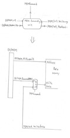

MEM 전방전달 유닛이 제대로 작동하기 위해선 MEM/WB 파이프라인에 EX/MEM 파이프라인의MemWrite 신호가 저장될 필요가 있다.
MEM/WB 파이프라인에 MemWrite 신호와 EX/MEM 파이프라인에 MemRead가 신호가 인가되어 있고,
WB단계에서 작성할 레지스터 번호와 MEM단계에서 메모리에 저장할 레지스터 번호가 같다면 WB단계의 MemtoReg MUX 출력을 MEM단계로 전방전달하는 방식이다.

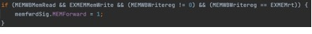

MEM 전방전달 유닛에서 인가하는 신호가
의미하는 바는 다음 표와 같다.

<table class=MsoTableGrid border=1 cellspacing=0 cellpadding=0 width=633
 style='width:474.9pt;margin-left:-7.35pt;border-collapse:collapse;border:none'>
 <tr>
  <td width=104 valign=top style='width:78.0pt;border:solid windowtext 1.0pt;
  background:#B4C6E7;padding:0cm 5.4pt 0cm 5.4pt'>
  
전방전달 신호

  </td>
  <td width=123 valign=top style='width:92.15pt;border:solid windowtext 1.0pt;
  border-left:none;background:#B4C6E7;padding:0cm 5.4pt 0cm 5.4pt'>
  
소스

  </td>
  <td width=406 valign=top style='width:304.75pt;border:solid windowtext 1.0pt;
  border-left:none;background:#B4C6E7;padding:0cm 5.4pt 0cm 5.4pt'>
  
설명

  </td>
 </tr>
 <tr>
  <td width=104 valign=top style='width:78.0pt;border:solid windowtext 1.0pt;
  border-top:none;padding:0cm 5.4pt 0cm 5.4pt'>
  
MEMForward = 0

  </td>
  <td width=123 valign=top style='width:92.15pt;border-top:none;border-left:
  none;border-bottom:solid windowtext 1.0pt;border-right:solid windowtext 1.0pt;
  padding:0cm 5.4pt 0cm 5.4pt'>
  
EX/MEM 파이프라인

  </td>
  <td width=406 valign=top style='width:304.75pt;border-top:none;border-left:
  none;border-bottom:solid windowtext 1.0pt;border-right:solid windowtext 1.0pt;
  padding:0cm 5.4pt 0cm 5.4pt'>
  
데이터 메모리의 Write data로
  ForwardB MUX의 출력값이 들어옴

  </td>
 </tr>
 <tr>
  <td width=104 valign=top style='width:78.0pt;border:solid windowtext 1.0pt;
  border-top:none;padding:0cm 5.4pt 0cm 5.4pt'>
  
MEMForward = 1

  </td>
  <td width=123 valign=top style='width:92.15pt;border-top:none;border-left:
  none;border-bottom:solid windowtext 1.0pt;border-right:solid windowtext 1.0pt;
  padding:0cm 5.4pt 0cm 5.4pt'>
  
MEM/WB 파이프라인

  </td>
  <td width=406 valign=top style='width:304.75pt;border-top:none;border-left:
  none;border-bottom:solid windowtext 1.0pt;border-right:solid windowtext 1.0pt;
  padding:0cm 5.4pt 0cm 5.4pt'>
  
데이터 메모리의 Write data로
  WB단계의 MemtoReg
  MUX의 출력값이 들어옴

  </td>
 </tr>
</table>

&nbsp;

<h2><a name="_Toc104314832">해저드 검출 유닛</a></h2>

전방전달 유닛들이 모든 Data dependency를 해결하는 것은 아니다. 다음 사진과 같은 경우를 생각해보자.

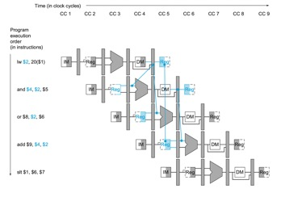

<a
href="#_edn7" name="_ednref7" title="">[vii]</a>(David A. Patterson, John
L. Hennessy, n.d.)

lw에서 작성하는
레지스터와 그 다음 명령어인 and에서 읽는 레지스터가 $2로 같다. lw에서 $2에 쓰이는 값은 MEM단계가 완료되어야
확정되므로 한 단계의 Stalling이 필요하다. 그렇지 않으면
Clock Cycle 5의 WB단계의 값을 Clock Cycle 4의 EX단계로 전방전달해야 하는 시간적 모순이 발생하게 된다.

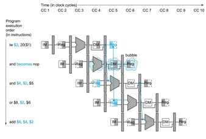

<a
href="#_edn8" name="_ednref8" title="">[viii]</a>(David A. Patterson, John
L. Hennessy, n.d.)

and 명령어를 NOP로 바꾸어 한 cycle stalling을 하게 되면, Clock Cycle 5의 WB단계의 값을 같은 Clock Cycle 5의 EX단계로 전달하게 되므로 시간적 모순이 해결되어
정상적으로 전방전달이 가능하게 된다. 이러한 해저드를 Load-use hazard라고 한다. 이 해저드를 검출하기 위해선 또다른 유닛이 필요하다.

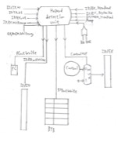

해저드 검출 유닛은 ID단계에서 rs나 rt값이 EX단계의 rt값과 같을 경우 PC와 IF/ID 파이프라인,
BTB(Branch Target Buffer), ID/EX 파이프라인의
제어 신호들을 0으로 만듦으로써 아무것도 하지 않는 NOP를 만들어낸다. Load-use hazard를 감지하고 Stalling하기 위한 코드는 다음과 같다.

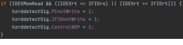

하지만, ID단계에서 분기 연산을 하는 데이터패스에서 만약 lw명령어 바로 뒤에 beq 혹은 bne가 뒤따라 온다면 1cycle의 Stalling으로는 올바른 결과를 도출해낼 수 없다. 앞에서 말했듯이
lw명령어의 결과는 MEM단계가 완료되어야 확정되므로 beq 혹은 bne와 lw명령어 사이의 거리가 최소 3이 되도록 해야 한다. 따라서 이 경우 2cycle의 Stalling이 필요하다.

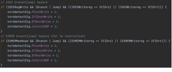

위와 같이 조건을 추가한다면 분기 연산과
lw간에 2cycle의 NOP를 추가함으로써 해결할 수 있다.

&nbsp;

<h2><a name="_Toc104314833">분기 예측 </a>Scheme</h2>

앞선 Introduction-분기 예측 항목에서 발언한 것과 같이 성능 손실을 최대한 줄이기
위하여 고안된 것이 분기 예측이라고 할 수 있다. Always not-taken을 제외한 scheme은 Branch Target Buffer가 필요한데, 이는 IF단계와 ID단계에 걸쳐서 사용된다. 먼저 IF단계에서 PC값이 버퍼에 저장된 분기 명령어의 PC값과 일치하는지 판단하고, ID단계에서 예측이 HIT했는지 확인 후 결과에 따라
예측 비트를 업데이트 하거나, 만약 PC값이 버퍼에 없었다면 버퍼에 PC값과 분기 목적지 주소를 저장한다. 또한, 동적 분기 예측인 경우 Direction
predictor필자가 작성한 프로그램에서 구현한 분기 예측 scheme은 정적 분기 예측 중 Always not-taken, Always taken,
Backward Taken-Forward Not Taken과 동적 분기 예측 중 One-Level branch predictor(1bit, 2bit-Saturating, 2bit-Hysteresis),
Two-Level Gshare branch predictor(1bit, 2bit-Saturating, 2bit-Hysteresis)이다.

&nbsp;

<h3 style='margin-left:50.0pt;text-indent:-20.0pt'><a name="_Toc104314834">Always not-taken</a></h3>

항상 분기하지 않는다고 예측하는 것이다. Unconditional jump 명령어가 아닌 한 어떤 명령어가 들어와도 PC + 4를 다음 PC값으로 설정하고, ID단계에서 분기가 아님으로 판정되면
그대로 진행하고, 분기로 판정되면 IF/ID 파이프라인의 명령어를 0으로 만들고 계산된 분기 주소로 점프한다. 이 방식은
따로 BTB와 같은 분기 예측기를 둘 필요가 없으므로 버퍼에서
확인하는 과정과 업데이트하는 과정이 없어서 구조가 간단하다는 것이 장점이다. 하지만 프로그램이 분기를 타는 과정이 많은 경우, 적중률이 낮아진다는 것이 단점이다.

&nbsp;

<h3 style='margin-left:50.0pt;text-indent:-20.0pt'><a name="_Toc104314835">Always taken</a></h3>

이 scheme부터 분기 예측기인 BTB가 필요하다. PC값이 이전에 beq나 bne명령어를 가리켰는지 확인하는 과정이 필요하기 때문이다. 분기 명령어를 한번 처리해서 BTB에 PC값이 저장되면, 그 다음부터 IF단계에서 확인 후 항상 분기를 탄다고
예측하여 분기 목적지 주소로 PC를 업데이트 한다. 아래 사진은 IF단계에서 BTB를 확인하는 코드이다.

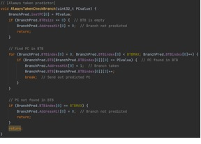

&nbsp;

<h3 style='margin-left:50.0pt;text-indent:-20.0pt'><a name="_Toc104314836">Backward Taken, Forward Not Taken(BTFNT)</a></h3>

BTB에 저장된 분기 목적지 주소가 PC값보다 작으면
분기를 탄다고 예측하고, 아니면 분기를 안탄다고 예측하는 scheme이다. 이는 분기 명령어가 for, while처럼 반복문을
의미하는 경우 매우 높은 적중률을 보인다. 아래 사진은 BTB에서 분기 목적지 주소가 PC값보다 큰지 혹은 작은지를 확인하는 과정을 구현한 것이다.

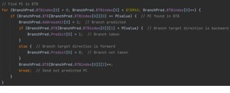

&nbsp;

<h3 style='margin-left:50.0pt;text-indent:-20.0pt'><a name="_Toc104314837">One-Level branch predictor</a></h3>

이 scheme부터 과거의 분기 이력을 참조하여 동적으로 분기를 예측하게 된다. 과거 이력을 참조할 때 카운터라는 State
machine이 쓰이게 된다. 1비트 카운터는 단순히 직전의 분기 이력을 저장하는 장치에 불과하다. 직전 분기 명령어가 분기를 탔다면 1, 아니면 0인 상태이다. 이는 분기가 거의 항상 일어날지라도, 분기가 일어나지
않을 때는 한 번이 아닌 두 번의 잘못된 예측을 할 가능성이 높게 되는 문제점을 갖고 있다. 이 같은 약점을 보완하기 위해 2비트 카운터를 사용한다.<a href="#_edn9" name="_ednref9" title="">[ix]</a> (David A. Patterson, John
L. Hennessy, n.d.)

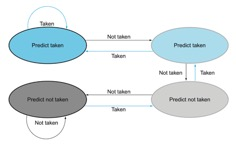

<a
href="#_edn10" name="_ednref10" title="">[x]</a>(David A. Patterson, John
L. Hennessy, n.d.)

위 사진은 2비트 Saturating 카운터이다. 간단히 말해 00상태에서 2번 연속으로 분기를 탔다면 다음부터 그
분기는 탄다고 예측하고, 11상태에서 2번 연속으로 분기를 타지 않았다면 다음부터 그 분기는 타지 않는다고 예측한다. 2비트 Hysteresis 카운터는 00상태에서 2번 연속으로 분기를 탔다면 11로 바로 상태를 변경하고, 11상태에서 2번 연속으로 분기를 타지 않았다면 00으로 바로 상태를 변경한다.

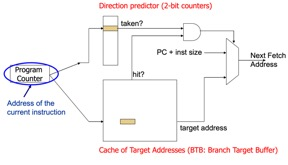

<a href="#_edn11"
name="_ednref11" title="">[xi]</a> (Carnegie
Mellon University, 2015)

위 사진이 One-Level branch predictor의 구조이다. Direction predictor와 BTB에서 PC값을 찾은 다음, BTB에 PC값을 index로 하는 분기 목적지 주소가 존재하고 Direction predictor에서도 분기를 탄다고 예측을 하면 다음 PC값으로 분기
목적지 주소를 업데이트하는 방식이다. 여기서 BTB와 Direction predictor는 실제로는 PC값 전체를 index로 하지 않고 hash연산을 거쳐서 비트 수를 줄인 값을 index로 사용한다. PC값 전체를 index로 사용하게 되면 유닛의 크기가 커지고, 찾는 시간도
늘어나며 전력 소모도 커지기 때문이다. 필자가 작성한 프로그램에선 hash연산은 구현하지
않고 PC값 전체를 index하는 것으로 구현하였다.

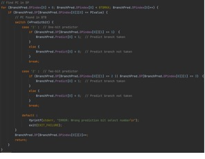

위 사진은 이전 BTFNT의 BTB에서 추가된 부분이다. Direction predictor에서 카운터의 상태에 따라 분기를 탈지 안탈지 결정하는 과정을 구현한 코드이다.

<h3 style='margin-left:50.0pt;text-indent:-20.0pt'><a name="_Toc104314838">Two-Level Gshare branch predictor</a></h3>

One-Level branch
predictor에서 프로그램 전반에 걸친 분기 이력을 나타내는 Shift 레지스터인 Global History
Register(GHR)가 추가된 예측 scheme이다. 분기 명령어가 다른 분기에서 영향을 받을
수 있으므로 그 관계를 고려하여 정확도를 높이는 방식이다.

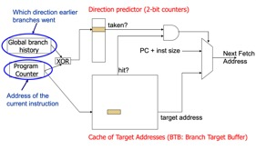

<a
href="#_edn12" name="_ednref12" title="">[xii]</a>(Carnegie Mellon
University, 2015)

GHR의 작동방식은 다음과 같다.

-&nbsp;&nbsp;&nbsp;&nbsp;&nbsp;&nbsp;
4비트 GHR 기준 초기상태 0000 &lt;GHR
= 0000(2)&gt;

-&nbsp;&nbsp;&nbsp;&nbsp;&nbsp;&nbsp;
분기 명령어 만남 -&gt; 분기를 탔다고 가정, 마지막 비트를 1로 변경 &lt;GHR = 0001(2)&gt;

-&nbsp;&nbsp;&nbsp;&nbsp;&nbsp;&nbsp;
다음 분기 명령어 만남 -&gt; 분기를 타지 않았다고 가정, 기존 값을 왼쪽으로
1번 shift한 뒤 마지막 비트를 0으로 상태를 변경
&lt;GHR = 0010(2)&gt;

-&nbsp;&nbsp;&nbsp;&nbsp;&nbsp;&nbsp;
위 과정 반복

Gshare predictor의 Branch History Table(BHT=Direction predictor)의 크기는 GHR의 비트 수에 2를 제곱한 만큼이
된다. 필자가 작성한 프로그램에선 GHR를 4비트로 설정하였으므로 BHT의 크기 또한 2의 4제곱인 16으로 설정하였다. Index는
0000(2)부터 1111(2)까지 이다. BHT에서 카운터 값을 찾을 때는 일종의 hash연산을 거친다. PC값은 최하위 2비트가 항상 0이므로, 이는 XOR 연산을 할 때 의미가 없는 값이 된다. 따라서 PC값을 오른쪽으로 2번 shift한 후 최하위 4비트와 GHR을 XOR연산, 그 값을 Direction predictor의 index에서 찾는다. 아래 사진이 GHR과 PC값을 합쳐서 index로 변환하는 코드이다. 

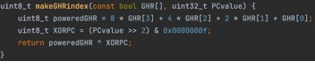

BTB는 이전 scheme들과 같다.

<h3 style='margin-left:50.0pt;text-indent:-20.0pt'><a name="_Toc104314839">Two-Level Local branch predictor</a></h3>

Gshare 분기 예측이 프로그램 전반에 걸친 분기 이력을 참조했다면, Local 분기 예측은 각 분기 명령어마다의 분기 이력을 참조하는 scheme이다. Direction predictor의 index가 PC가 가리키는 명령어의 분기 이력이 된다.

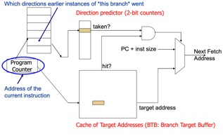

<a
href="#_edn13" name="_ednref13" title="">[xiii]</a>(Carnegie Mellon
University, 2015)

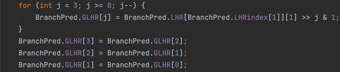

이전 Gshare에선 GHR과 PC를 XOR연산한 값이 Direction predictor의
index였지만, Local에선 Local History Register(LHR)가 그대로 index로 쓰이므로 LHR 배열의 분기 이력 부분을 따로 뽑아내는 과정이 필요하다. 위 사진이 이를 구현한 코드이다.

&nbsp;

<h2><a name="_Toc104314840">Architectural visible state</a></h2>

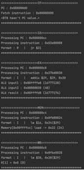

위 사진과 같이 매 Clock Cycle마다 각 단계에서 처리중인 PC, PC가 가리키는 명령어, Decode된 명령어, 메모리 접근, 레지스터 작성 등의 정보를 출력하도록 구현하였다.

&nbsp;

&nbsp;

&nbsp;

&nbsp;

&nbsp;

&nbsp;

<h2><a name="_Toc104314841">데이터패스</a>(Gshare)</h2>

지금까지 상기한 전방전달, 해저드 검출 유닛과 Two-Level
Gshare predictor를 합친 데이터패스는 다음과 같다.

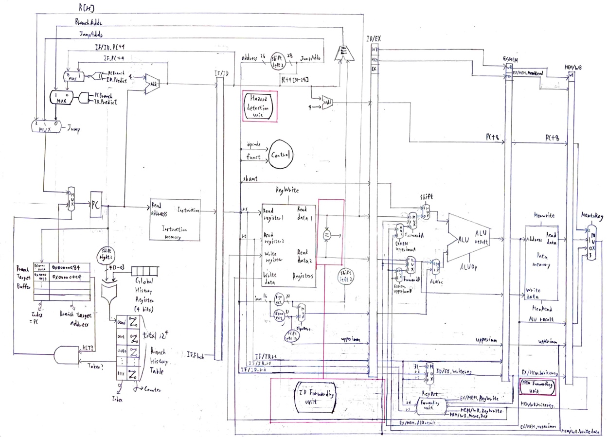

빨간색으로 표시한 부분을 확대한 것은 아래와 같다.

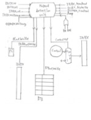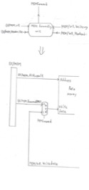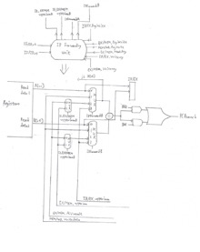

<b> 
</b>

<b>&nbsp;</b>

<h1><a name="_Toc104314842"><b>Conclusion</b></a></h1>

&nbsp;

<h2><a name="_Toc104314843">입력 파일 별 결과 및 분석</a></h2>

먼저 분기 명령어가 존재하는 입력 파일
간 모든 분기 예측의 적중률을 비교한 그래프는 다음과 같다. 동적
예측기는 1비트, 2비트 Saturating, Hysteresis의
평균값을 표본으로 하였다.

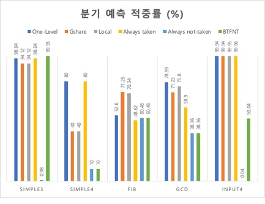

simple3 파일의 경우 1부터 100까지 더하는 for문이 실행되는 코드이기 때문에 BTFNT의 정확도가
제일 높았다. simple4 파일은 1부터 10까지 재귀함수를 통해 더하는 코드여서 simple3와는 달리 BTFNT의 정확도가 제일 낮은 것을
볼 수 있다. 항상 분기를 타다가 마지막에 값을 반환할 때만 분기를
타지 않기 때문에 Always taken과 One-Level이 제일 높은 적중률을 보였다. fib 파일은 분기가 상당히 복잡하고 예측 불가능하게 이루어지는 파일이다. 분기 명령어마다의 분기 이력을 참조하는 Local이 제일 높았고, 다음으로 프로그램의 전체적인 분기 이력을 참조하는 Gshare가 뒤를 이었다. gcd 파일의 결과도 fib 만큼은 아니지만, 다른 파일들보다 분기의 복잡도가 높아서 정적 분기 예측보다 동적 분기 예측의 적중률이 높게 나왔다. input4 파일은 총 실행된 분기 명령어의 수는 제일 많았지만, 거의 모든 상황에서 분기를 탔기 때문에 Always not taken과 BTFNT를 제외하곤 적중률이 매우 높게 나왔다. Always not-taken은 0.04%라는 매우 낮은 수치를 보여주었다.

&nbsp;

다음 그래프는 위 그래프에서 동적 예측기의
예측 정확도 만을 가져온 것이다.

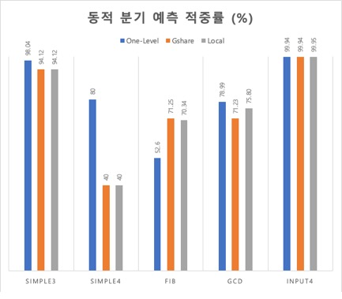

분기를 불규칙하게 타는 fib 파일에서 Gshare의 적중률이 제일 높았다. 이를 통해 분기를 예측하기 복잡한 프로그램의 경우, 전체적인 분기 이력을 참조하여 예측하는 것이 제일 정확도가 높다는 결론을 도출했다. 나머지 입력 파일 들에선 input4를 제외하곤 One-Level이 높은 적중률을 보여주었다. 하지만, 이 그래프만을 보고 One-Level이 평균적으로
제일 높은 적중률을 보여준다고 단언할 수는 없다. simple4 파일은 실행 중 거쳐가는 분기 명령어의 수가 10개에 불과하여 평균값에 포함하기엔 적절하지 않다.

다음 그래프는 분기 예측 별 적중률의
평균을 비교한 것이다. 단, 위에서 언급한 것과 같이 simple4
파일은 실행하는 분기 명령어의 수가 10개에 불과하여 예측이 틀린 횟수에 비해 적중률에 미치는 영향이 커져 제외하였다.

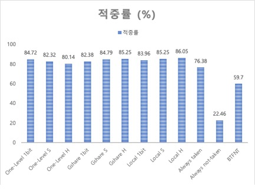

2비트 Hysteresis 카운터를 적용한 Local이 simple4를 제외한 입력 파일들을 대상으로
평균 적중률이  가장 높게 나왔다. 2비트 Saturating 카운터를 적용한 Local과 2비트 Hysteresis 카운터를 적용한 Gshare가 공동으로 2순위이고, 2비트 Saturating 카운터를 적용한 Gshare가 3순위이다. One-Level과 Gshare, Local 각각 3가지를 하나로 고려하여 분석한다면 Local
&gt; Gshare &gt; One-Level &gt; Always taken &gt; BTFNT &gt; Always not-taken 순으로 평균 적중률이 높게 나왔다. 주목할 만한
점은, 정적 분기 예측 scheme 중 Always-taken이 꽤 높은 평균 적중률을 보였다는 것이다. Direction predictor같은 별도의 분기 이력 참조 없이 BTB만으로도
높은 적중률을 보여준 것은 눈 여겨 볼 만 하다.

저번 과제였던 Single-Cycle MIPS에서 fib
파일을 실행했을 때 2679 Clock Cycle이 걸렸고, 이번 과제를 수행하며 작성한 프로그램에선
분기 예측 scheme에 따라 가장 높은 경우 3125 Clock Cycle이, 가장 낮은 경우 2981 Clock Cycle이
걸렸다. 비록 Single-Cycle보다 사용한 Clock Cycle은 높아지지만, Multi-Cycle이 적용된 경우 한 Clock Cycle에 소모되는 시간(Clock
Cycle Time=CCT)이 Single-Cycle보다 짧아지게 된다. 예를 들어 Single-Cycle의 CCT가 lw 명령어를 수행하는데 걸리는 시간인 600ps라 한다면, Multi-Cycle의 경우 CCT는 메모리에서 명령어를 가져오거나
데이터를 읽고 쓰는 시간인 200ps가 되고, j와 같이 IF단계에서 명령어 수행에 필요한 연산이 모두 끝나는 경우 IF단계 이후로는 진행하지 않게 되어 cycle을 절약할
수 있다. 여기에 파이프라인을 적용한다면, 모든 명령어가 5단계를 거치게 되지만, 단순 Multi-Cycle의 CCT를 가지고 한 cycle에 최대 5개의 명령어를 수행 할 수 있으므로 처리율이 크게 오르게 된다. 위 CCT를 가정하고 입력 파일 별 가장 높은 Clock Cycle을 소모한 파이프라인 Single-Cycle의 총
CCT 비율을 계산하면 다음 그래프와 같다.

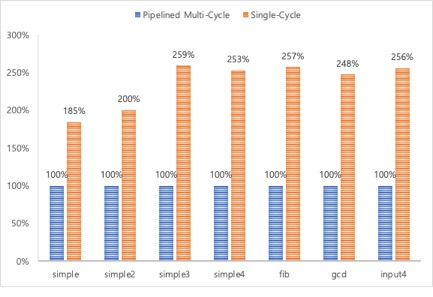

위 그래프를 통해 Single-Cycle보다 Clock Cycle 수가 늘어나더라도, 오히려 총 실행 시간은 짧아지는 파이프라인의 특성을 알아볼 수 있다.

<h2><a name="_Toc104314845">구현 환경</a></h2>

OS : macOS

컴파일러 : clang 14.0.0

</html>
